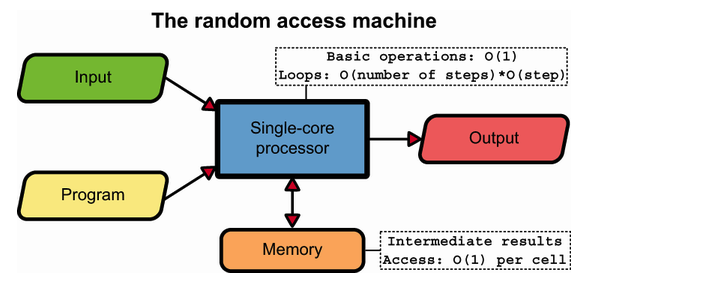
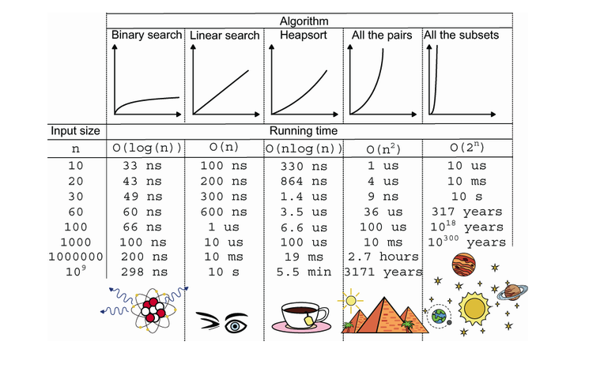

# Big-O Notation

How to measure the efficiency of an algorithm?

1. Measuring the implementation of an algorithm, running the code on various inputs, and measuring the time and the memory it takes. This is called `profiling`.

2. Reasoning about an algorithm in more abstract terms, using a simplified model for the machine it would run on and abstracting many details. In this case, we focus on coming up with a mathematical law describing the running time and the memory in terms of the input size. This is called `asymptotic analysis`.

`Big-O notation` is an asymptotic analysis tool that describes the limiting behavior of a function when the argument tends towards a particular value or infinity. It is used to describe the upper bound of the running time of an algorithm. To study Big-O notation we are going to use the RAM model (Random Access Machine model) which is a simplified model of a computer, with a single processor and an infinite amount of memory that takes the same time to access to any location.

## Common Growth Functions

In addition to this table, it's worth mentioning `O(1)` which is the best case scenario for an algorithm. It means that the running time of the algorithm is constant, regardless of the input size.

