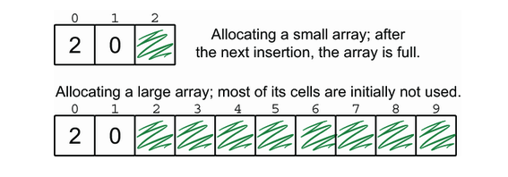

# Dynamic Arrays: Handling dynamically sized datasets

## Limitations of static arrays

- Fixed size: The size of the array is fixed and cannot be changed once it is allocated. We need to know the size of the array in advance or create a new array with a larger size and copy the elements from the old array to the new array. We can also create a huge array to accommodate the maximum number of elements we expect to store, but this is not memory efficient.

Dynamic arrays are implemented with static arrays, and we still have to pay the price of allocating a new array and throwing away the old one every time we need to resize it

## Dynamic arrays

The best strategy to handle dynamically sized datasets is to use dynamic arrays. A dynamic array is an array that grows in size as needed. It is implemented using a static array, and when the array is full, a new array is created with a larger size, and the elements from the old array are copied to the new array.

**_A good approach to increase the size of the array is to double the size of the array when it is full._**

We could also need to take care of shrinking the array when the number of elements in the array is less than half of the size of the array. This is to avoid wasting memory, but it's important to apply this strategy only when the array's content is significantly smaller than the size of the array. For example one quarter of the size of the array. (we are applying a kind of hysteresis to avoid resizing the array too often)

**_Note: There is no perfect solution because the perfect choice could only be made if we knew the sequence of insertions and deletions in advance. But this is a reasonably good solution that works well in most cases._**

## Implementing dynamic arrays

1. We start with an array of size one (unless the client specifies an initial capacity).

2. If we need to insert a new element and the static array is already filled to its maximum capacity, we resize the array by doubling its size.

3. After we remove an element from the array, we resize the array by halving its size if only a quarter of the maximum capacity is filled.
